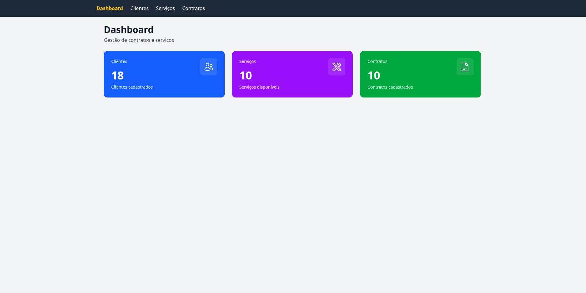
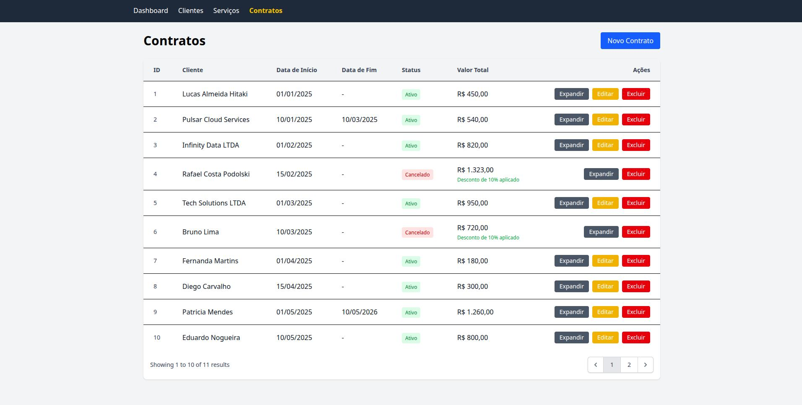
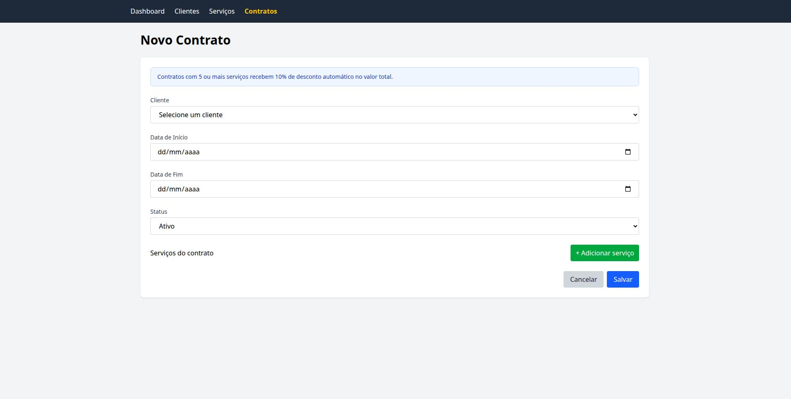

# 📄 Contract Flow — Gestão de Contratos e Serviços

Sistema desenvolvido como desafio técnico Full Stack, simulando um mini ERP de contratos recorrentes para gestão de clientes, contratos e serviços recorrentes.

O projeto foi construído com foco em:

* organização de código
* separação de responsabilidades
* modelagem de regras de negócio
* clareza arquitetural
* manutenção e escalabilidade

---

# 🚀 Funcionalidades

## Clientes

* Cadastro de clientes
* Edição e remoção
* Validação de CPF/CNPJ
* Validação de email
* Controle de status (Ativo/Inativo)

## Serviços

* Cadastro de serviços
* Valor base mensal

## Contratos

* Cadastro de contratos vinculados a clientes
* Controle de status (Ativo/Cancelado)
* Data de início e término
* Listagem detalhada dos contratos
* Cálculo dinâmico do valor mensal

## Itens do Contrato

* Adição e remoção dinâmica de serviços
* Quantidade por serviço
* Valor unitário customizável
* Cálculo automático do subtotal

---

# 🧠 Regra de Negócio Implementada

Foi implementada uma regra de desconto automático aplicada a contratos com 5 ou mais itens de serviço, realizando o cálculo dinamicamente sobre o subtotal do contrato.

### Regra aplicada

Contratos com quantidade total de serviços maior ou igual a **5 itens** recebem automaticamente **10% de desconto** sobre o subtotal do contrato.

### Exemplo

| Serviço   | Quantidade | Valor  |
| --------- | ---------- | ------ |
| Serviço A | 3          | R$ 100 |
| Serviço B | 2          | R$ 200 |

Subtotal: R$ 700
Desconto: 10%
Total final: R$ 630

---

# 🔒 Regras adicionais implementadas

* Clientes inativos não podem receber novos contratos
* Contratos cancelados não podem ser editados
* Valor total calculado dinamicamente com base nos itens atuais
* Contratos aceitam múltiplos serviços
* Valor unitário pode divergir do valor base do serviço

---

# 🛠️ Tecnologias Utilizadas

## Backend

* PHP 8.3
* Laravel 13
* PostgreSQL
* PHPUnit

## Frontend

* Vue.js 3
* Vite
* TailwindCSS 4

## Infraestrutura

* Docker
* Docker Compose

---

# 🏗️ Estrutura da Aplicação

O projeto foi organizado seguindo separação clara de responsabilidades:

```text
app/
├── Http/
│   ├── Controllers
│   └── Requests
├── Models
└── Services
```

## Organização das camadas

### Controllers

Responsáveis apenas pelo fluxo HTTP e integração com as regras da aplicação.

### Requests

Responsáveis pelas validações de entrada.

### Models

Representam as entidades principais do domínio:

* Cliente
* Contrato
* ContratoItem
* Serviço

### Services

Utilizados para centralizar operações específicas do domínio de contratos.

---

# 📚 Modelagem das Entidades

A aplicação foi modelada utilizando relacionamentos simples e bem definidos para representar o domínio de contratos recorrentes.

```text
Cliente
 └── possui muitos Contratos

Contrato
 ├── pertence a um Cliente
 └── possui muitos Itens de Contrato

ContratoItem
 ├── pertence a um Contrato
 └── pertence a um Serviço

Serviço
 └── pode estar presente em múltiplos itens de contrato
```

# ⚙️ Frontend

O frontend foi construído utilizando Blade + Vue.js 3.

A utilização do Vue foi aplicada principalmente no formulário de criação e edição de contratos, por possuir maior complexidade devido à manipulação dinâmica dos itens do contrato.

Funcionalidades implementadas no frontend:

* adição dinâmica de serviços
* remoção de itens
* atualização automática dos valores
* melhor experiência de uso para contratos complexos

---

# 🧪 Testes

Foram implementados testes automatizados utilizando PHPUnit.

Exemplos:

* validação de clientes
* criação de contratos
* regras de negócio principais

Para executar:

```bash
docker compose exec app php artisan test
```

---

# 🐳 Ambiente Docker

O projeto possui ambiente completo com Docker Compose:

* PHP/Laravel
* PostgreSQL
* PgAdmin

O PgAdmin foi incluído para facilitar a visualização, inspeção e administração do banco de dados durante o desenvolvimento e testes da aplicação.

---

# ▶️ Como executar o projeto

## ⚠️ Requisitos

* Docker
* Docker Compose

---

## 1 - 📥 Clonando o projeto

```bash
git clone git@github.com:mcl-rodrigues/laravel-contract-flow.git
cd laravel-contract-flow
```

---

## 2 - 🚀 Subindo ambiente Docker

```bash
docker compose up -d
```

---

## 3 - 📦 Instalando dependências backend

```bash
docker compose exec app composer install
cp .env.example .env
docker compose exec app php artisan key:generate
```

---

## 4 - 🎨 Instalando frontend

```bash
docker compose exec app npm install
docker compose exec app npm run build
```

---

## 5 - 🗄️ Banco de dados

```bash
docker compose exec app php artisan migrate:fresh --seed
```

## 6 - 🌐 Acessar o seguinte endereço no browser

--- http://localhost:8000

# 🌐 Acessos

## Aplicação

```text
http://localhost:8000
```

# 🐘 PgAdmin

## Acesso

```text
http://localhost:5050
```

### Credenciais

| Campo | Valor |
|---|---|
| Email | admin@admin.com |
| Senha | admin |

---

# 🔗 Configurando conexão com PostgreSQL

Após acessar o PgAdmin:

1. Clique com botão direito em **Servers**
2. Selecione **Register → Server**

## Aba: General

| Campo | Valor |
|---|---|
| Name | Contract Flow |

## Aba: Connection

| Campo | Valor |
|---|---|
| Host | postgres |
| Port | 5432 |
| Database | contract_flow |
| Username | admin-sistema-contrato |
| Password | admin123 |

Após salvar, o servidor PostgreSQL ficará disponível no painel lateral do PgAdmin.

---

# 🌱 Seeders

O projeto possui seeders para facilitar testes e demonstração das funcionalidades:

* clientes
* serviços
* contratos
* itens de contrato

---

# 📌 Decisões Técnicas

* Laravel utilizado pela velocidade de desenvolvimento e organização arquitetural
* PostgreSQL escolhido pela robustez e excelente integração com Laravel
* Vue aplicado apenas nos pontos de maior interatividade para evitar complexidade desnecessária
* Regras de negócio concentradas na camada de domínio/serviço
* Docker utilizado para padronização do ambiente

---

# 🔮 Melhorias Futuras

* API REST completa
* autenticação de usuários
* paginação e filtros avançados
* histórico/versionamento de contratos
* testes de integração mais abrangentes
* políticas de autorização
* cache de consultas
* painel administrativo

---

# 📸 Screenshots

## Dashboard

<a href="./docs/screenshots/dashboard.jpg">
  
</a>

---

## Contratos

<a href="./docs/screenshots/contracts-list.jpg">
  
</a>

---

## Formulário de Contrato

<a href="./docs/screenshots/contract-form.jpg">
  
</a>

---

# 📄 Licença

Projeto desenvolvido exclusivamente para fins de avaliação técnica.
